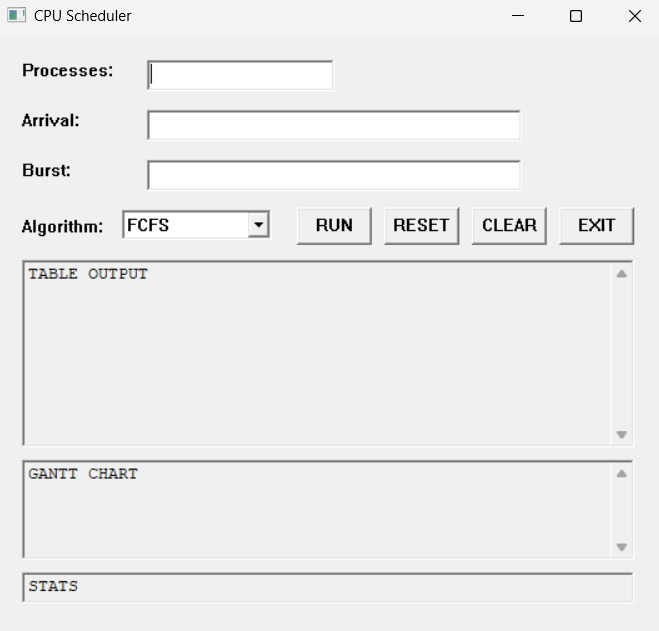

# CPU Scheduler Simulator

A GUI-based CPU Scheduling Simulator developed in **C using the Win32 API**. The application allows users to simulate and visualize CPU scheduling algorithms, generate a Gantt Chart, and calculate important scheduling metrics such as Waiting Time and Turnaround Time.



---

## Overview

CPU Scheduling is a fundamental concept in Operating Systems that determines how processes are allocated CPU time. This project provides an interactive desktop application where users can enter process information, select a scheduling algorithm, and instantly view the scheduling results.

The simulator calculates and displays:

- Completion Time (CT)
- Turnaround Time (TAT)
- Waiting Time (WT)
- Average Waiting Time
- Average Turnaround Time
- Gantt Chart Visualization

---

## Features

### Implemented Scheduling Algorithms

- First Come First Serve (FCFS)
- Shortest Job First (SJF - Non-Preemptive)
- Shortest Remaining Time First (SRTF - Preemptive)

### Application Features

- User-friendly graphical interface
- Process input through Arrival Time and Burst Time fields
- Algorithm selection using a dropdown menu
- Dynamic process statistics generation
- Gantt Chart visualization
- Average Waiting Time calculation
- Average Turnaround Time calculation
- Reset and Clear functionality
- Windows desktop application using Win32 API

---

## Technologies Used

- C Programming Language
- Win32 API
- Windows Desktop Development

---

## Project Structure

```text
CPU-Scheduler-Simulator/
│
├── src/
│   └── main.c
│
├── main-ui.png
│
├── README.md
```

---

## How to Run

### Prerequisites

- Windows Operating System
- Code::Blocks, Visual Studio, or any C compiler supporting Win32 API

### Steps

1. Clone the repository.

```bash
git clone https://github.com/ABK998/CPU-Scheduler-Simulator.git
```

2. Open the project in your preferred IDE.

3. Build and run the application.

4. Enter:
   - Number of Processes
   - Arrival Times
   - Burst Times

5. Select a scheduling algorithm.

6. Click **RUN** to generate results.

---

## Input Format

### Number of Processes

```text
4
```

### Arrival Times

```text
0, 1, 2, 3
```

### Burst Times

```text
8, 4, 9, 5
```

---

## Algorithms Included

### FCFS (First Come First Serve)

Processes are executed in the order they arrive.

### SJF (Shortest Job First)

The process with the shortest burst time among the available processes is selected first.

### SRTF (Shortest Remaining Time First)

A preemptive version of SJF where the CPU always executes the process with the shortest remaining execution time.

---

## Example Output

### Process Table

```text
P    AT    BT    CT    TAT    WT
--------------------------------
P1   0     8     8      8      0
P2   1     4     12     11     7
P3   2     9     21     19     10
P4   3     5     26     23     18
```

### Statistics

```text
Average Waiting Time = 8.75
Average Turnaround Time = 15.25
```

---

## Learning Outcomes

This project demonstrates:

- CPU Scheduling Concepts
- Operating Systems Fundamentals
- Win32 API Programming
- Event-Driven Programming
- Dynamic Memory Management
- Structures in C
- Desktop GUI Development

---

## Future Enhancements

- Round Robin Scheduling
- Priority Scheduling
- Priority Preemptive Scheduling
- Multilevel Queue Scheduling
- Improved Gantt Chart Visualization
- Process Sorting by Arrival Time
- Export Results to File
- Enhanced UI Design
